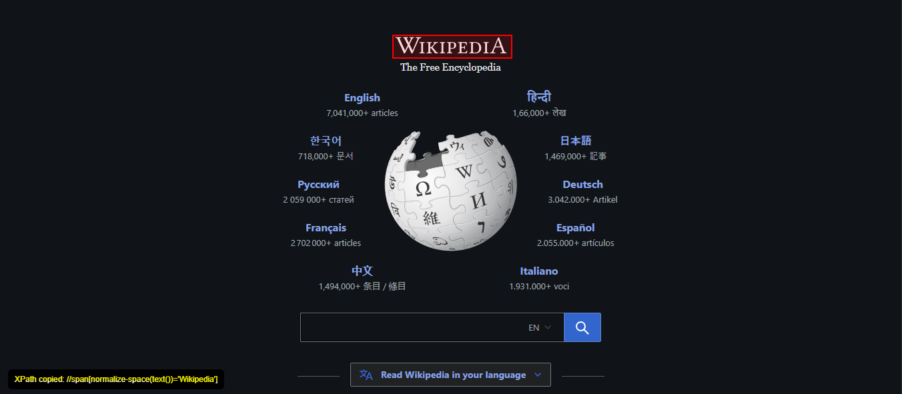

# 🚀 XPath Generator - Chrome Extension  

A simple Chrome Extension for Automation Engineers to easily **generate robust XPath locators** by hovering or clicking on elements in any webpage.  
This tool helps you avoid manually writing complex XPaths and makes automation scripting faster and more accurate.  

---

## ✨ Features
- 🔎 Generate **unique XPath** based on:
  - `id`  
  - `class`  
  - `text()` (fallback when id/class not available)  
  - DOM hierarchy  
- 📋 Auto **copy XPath to clipboard** on click.  
- 🎯 Highlights elements in **red box** when hovered.  
- ⚡ Works with complex DOM structures.  
- 🖥️ Lightweight & fast (designed for Automation Engineers).  

---

## 📸 Screenshots 

 

---

## 🔧 Installation (Developer Mode)
1. Clone this repository or download the ZIP.  
2. Open **Google Chrome** → go to `chrome://extensions/`.  
3. Enable **Developer Mode** (top-right corner).  
4. Click **Load Unpacked** and select the project folder.  
5. Pin the extension from the toolbar for quick access.  

---

## 🛠️ How to Use
1. Open any webpage.  
2. Click **Start XPath Generator** from the extension popup.  
3. Hover over any element → red outline will appear.  
4. Click the element → XPath will be copied automatically to clipboard.  
5. Paste it directly in your automation code (Selenium / Playwright / Cypress etc.).  

---

## 📂 Project Structure
📦 xpath-generator-extension
┣ 📜 manifest.json
┣ 📜 content.js
┣ 📜 popup.html
┣ 📜 popup.js
┣ 📜 icon.png
┗ 📜 README.md

---

## 💡 Future Enhancements
- [ ] Support for **CSS Selectors** generation.  
- [ ] Export all captured locators into a JSON/Excel file.  
- [ ] Mini **Selenium IDE Lite Recorder** inside the extension.  

---

## 🤝 Contributing
Pull requests are welcome! For major changes, please open an issue first to discuss what you would like to change.  

---

## 👨‍💻 Author
- **Pawan Tiwari** – [LinkedIn](https://www.linkedin.com/in/pawan-tiwari-b82844198/) | [GitHub](https://github.com/CliffBooth07)  

---

⭐ If you like this project, don’t forget to **star the repo** and share it with other Automation Engineers 🚀  

